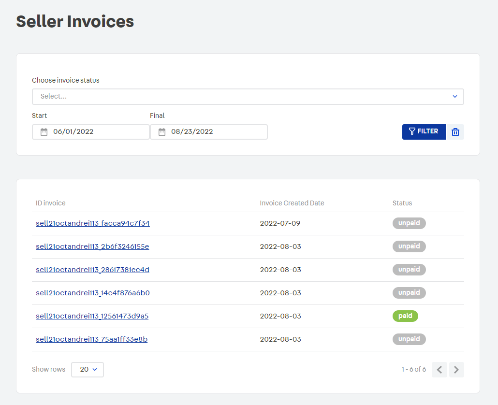

### 📢 **Don't fork this project. Use, contribute, or open issues through [Store Discussion](https://github.com/vtex-apps/store-discussion)**.

# External Invoice Viewer

**External Invoice Viewer** provides a way to list all invoices created by a specific seller, filter them by status or by a specific period of time.

## **Install**:

Using your console, logged in the desired account run the command:

`vtex install vtex.external-invoice-viewer`

## **Features**:

- List All Seller Invoices at the end of the billing cycle. Each invoice is listed with its respective status (`partial`, `paid` or `unpaid`) and with its creation date. 
  

- Invoices can be filtered by Status or by creation date
  
  

- Visualize invoice detail
  

- A copy of the invoice detail can be sent by e-mail. By default the e-mail will be sent to the vendor's address, but this value can be changed
  

## **API REST**

Endpoints for managing invoices and e-mail sending [here](API-REST.md)
